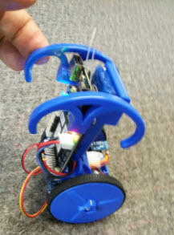

Python Examples for EduMIP Robot
================================

The following are python3 examples that run on the
[BeagleBone Blue](http://beagleboard.org/blue) based 
[EduMIP](http://strawsondesign.com/#!edumip-about) robot by
[Strawson Design](http://strawsondesign.com/).

The following use the [Adafruit BeagleBone python library](https://learn.adafruit.com/setting-up-io-python-library-on-beaglebone-black/overview).

- internalLED.py - Blink an interal LED
- button.py - Read the PAUSE button and flash an internal LED
- seqLEDs.py - Flashes the four USR LEDs in sequence

These use the Strawson Design [Robotics Cape library](http://strawsondesign.com/#!manual-install).

- encoders.py - Reads the motors encoders and displays the position
- imu.py - Read the Inertial Measurement Unit and displays the Acceraltion, Gyro, Compas and Temerature.
- motors.py - Spins the motors
- balance.py - Balances the robot.  Use the arrow keys to drive around
